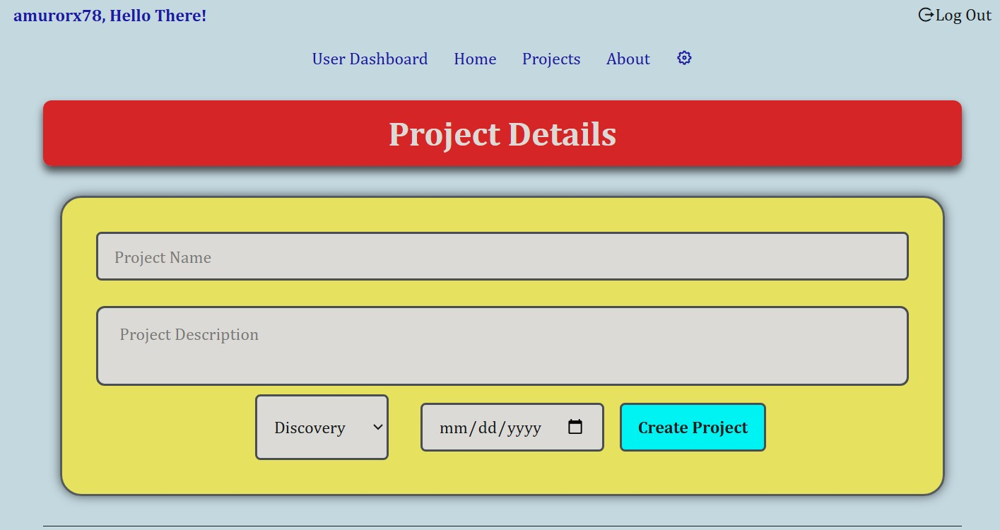
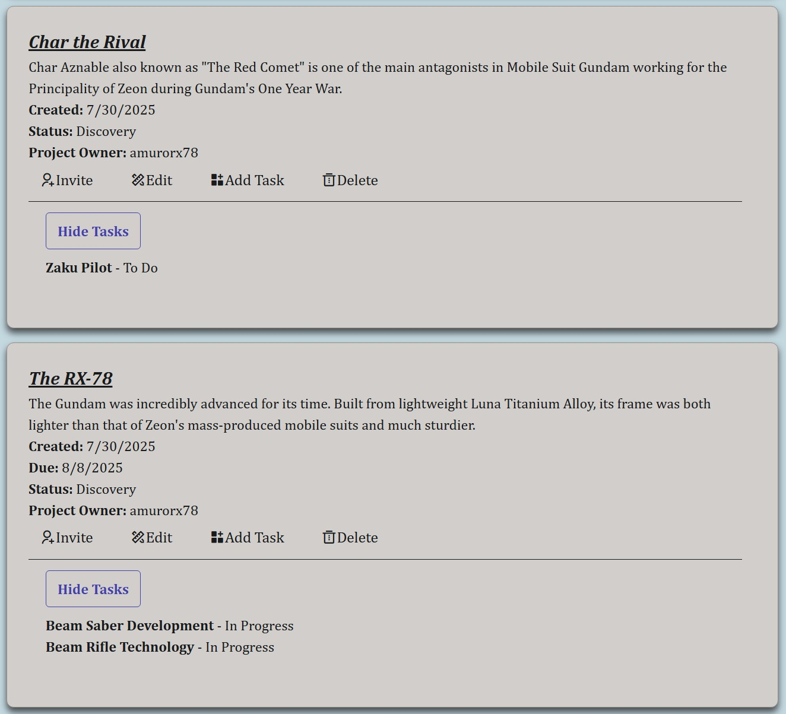
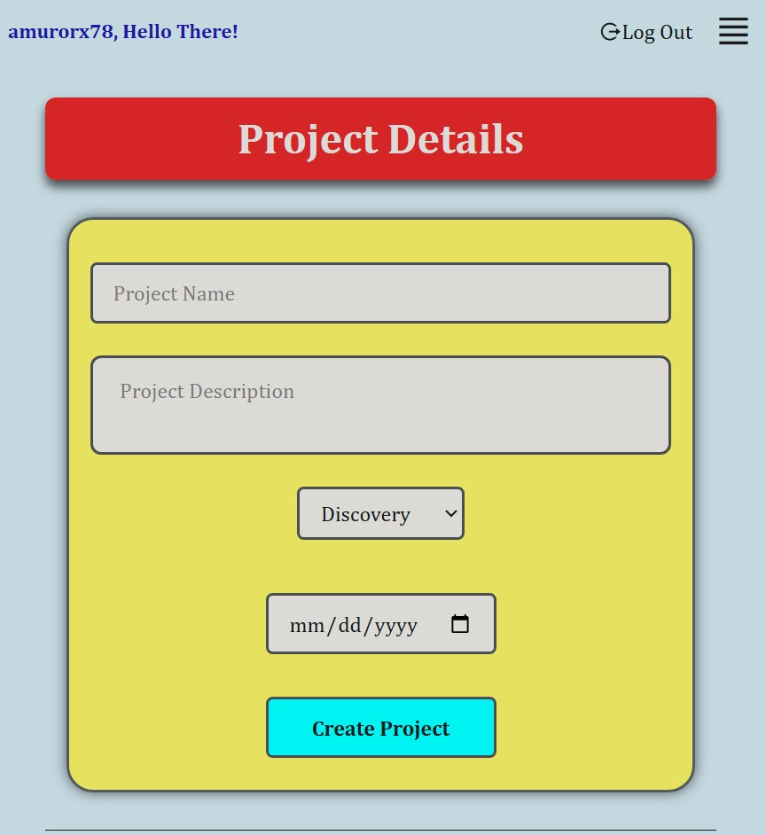
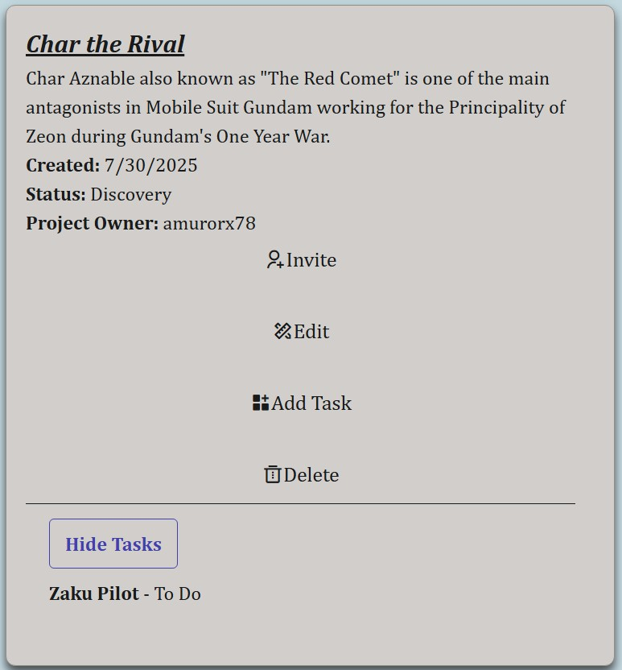

# Mod18 CAPSTONE PROJECT: Pro-Tasker Frontend Develpoment

Pro-Tasker is a RESTful API for managing users, projects, and tasks. It uses JWT-based authentication and enforces ownership-based authorization to ensure data privacy and integrity. The Frontend was developed utilizing solutions from REACT, AXIOS, and TAILWINDS.

## Table of contents

- [Overview](#overview)
  - [Links](#links)
  - [Screenshot](#screenshot)
- [Deployment Steps](#my-process)
  - [Requirements](#requirements)
  - [Creat Account](#create-account-if-necessary)
  - [Configure Netlify](#configure-netlify)
  - [Netlify](#netlfiy-configuration-and-deployment-process)
  - [Troubleshooting](#troubleshooting)
  - [Local Development](#local-deployment)
- [Directory](#directory)
- [Project Setup](#project-setup)
- [Features](#features)
- [Useful resources](#useful-resources)
- [Acknowledgments](#acknowledgments)

## Overview

This is a capstone project designed to synthesize the skills learned across multiple **Per Scholas** _Software Engineer_ modules. It is designed to plan and execute the development of a real-world, secure, and functional RESTful API from the ground up. Success will require careful planning, clean code, and a solid understanding of authentication and authorization principles.

### Links

- Solution URL: [GitHub: ProTasker Backend](https://github.com/DblRH600/pro-tasker-backend)
- Live Site URL: [Pro Tasker](https://protaskmanaging.netlify.app/)

### Screenshots









## Deployment Steps

### Requirements

- React
- Vite
- Axios
- Tailwinds
- React-Router-DOM
- DOTENV
- CSS custom properties
- Flexbox
- CSS Grid
- Mobile-first workflow
- Git
- GitHub Acc
- Netlify Acc

### Create Account (if necessary)

1. Create a GitHub Acc
   1 - Create a Repopository (Repo)

2. Create Netlify Acc

### Netlfiy Configuration and Deployment Process

1. Log in to Netlify Dasboard
2. Click on Projects
3. Click "Add New Project" and select "Import an Existing Project"
4. Connect the GitHub Repo
5. Configure Services:
  Project Name: Repo-Name (if not taken)
  Add Environment Variables: VITE_BACKEND_URL
  Click Deploy "repo-name"

### Troubleshooting

- Check Netlify logs for deployment errors
- Ensure all environment variables are set correctly
- Check if the build process completes successfully

### Local Deployment

## Directory
```
pro-tasker/
└── frontend/
    ├── public/
    │   └── _redirects
    ├── src/
    │   ├── components/
    │   │   ├── Carousel.jsx
    │   │   ├── Footer.jsx
    │   │   ├── InviteButton.jsx
    │   │   └── Navbar.jsx
    │   ├── context/
    │   │   └── UserContext
    │   ├── css/
    │   │   └── carousel.css
    │   ├── data/
    │   │   └── carouselData.json
    │   └── pages/
    │       ├── About.jsx
    │       ├── Home.jsx
    │       ├── NotFound.jsx
    │       ├── Project.jsx
    │       └── Registration.jsx
    ├── App.jsx
    ├── index.css
    ├── main.jsx
    ├── .env
    ├── .env.production
    ├── .gitignorre
    ├── index.html
    └── package.json
```

## Project Setup

1. Initialize Project
```bash
npm create vite@latest

>npx
>create-vite

◆  Project name:
│  vite-project
└

◆  Select a framework:
│  ○ Vanilla
│  ○ Vue
│  ● React
│  ○ Preact
│  ○ Lit
│  ○ Svelte
│  ○ Solid
│  ○ Qwik
│  ○ Angular
│  ○ Marko
│  ○ Others
└

◆  Select a variant:
│  ○ TypeScript
│  ○ TypeScript + SWC
│  ○ JavaScript
│  ● JavaScript + SWC
│  ○ React Router v7 ↗
│  ○ TanStack Router ↗
│  ○ RedwoodSDK ↗
│  ○ RSC ↗
└
```
2. CD Into Project Directory and Initialize
```bash
cd c:\...\viteproj
npm i axios dotenv react-router-dom
npm i tailwindcss @tailwindcss/vite
``` 
  [] *Note*: Any additional depedencies (e.g.: heroicons)installed are developer discretion based 

## Features

- **User Authentication**
  - Login and registration utilizing _hashed_ passwords
  - JWT-based secure sessions

- **UI Features**
  - Responsive design optimized for various devices
  - Reusuable component library

- **Navigation and Routing**
 - Client side routing via react-router-dom for seamless experience
 - Redirects and route guards ti support authentication
 - Dynamic routing implementation
 
## Code Snipets
```jsx
return (
    <nav className="navbar-container">
      {/* top bar for mobile view should always show logout and greeting when logged in */}
      <div className="nav-top">
        <span className="greet">
          {currentUser ? `${currentUser?.username}, Hello There!` : ""}
        </span>

        <div className="navbar-actions">
          {currentUser && (
            <button
              className="logout-btn"
              onClick={logout}
              style={{ background: "none" }}
            >
              <i className="ri-logout-circle-r-line"></i>
              Log Out
            </button>
          )}

          {/* hamburger */}
          <div
            className="menu-toggle"
            onClick={() => setIsMenuOpen(!isMenuOpen)}
          >
            {isMenuOpen ? (
              <button>
                <i className="ri-close-line"></i>
              </button>
            ) : (
              <button>
                <i className="ri-align-justify"></i>
              </button>
            )}
          </div>
        </div>
      </div>

      <div className="navbar desktop-nav">
        {/* conditional rendering for navbar configuration */}
        {currentUser ? (
          <div className="navbar">
            <NavLink to="*">User Dashboard</NavLink>
            <NavLink to="/">Home</NavLink>
            <NavLink to="/projects">Projects</NavLink>
            {/* <NavLink to="/tasks">Tasks</NavLink> */}
            <NavLink to="/about">About</NavLink>
            <NavLink to="*">
              <i className="ri-settings-5-line"></i>
            </NavLink>
          </div>
        ) : (
          <div className="navbar">
            <NavLink to="/">Home</NavLink>
            <NavLink to="/about">About</NavLink>
            <NavLink to="/signin">Login</NavLink>
          </div>
        )}
      </div>

      {/* mobile nav */}
      {isMenuOpen && (
        <div className="mobile-nav">
          {currentUser ? (
            // onClick function set for each NavLink in mobile menu to help control responsiveness & precision
          <div className="navbar">
            <NavLink to="*" onClick={() => setIsMenuOpen(false)}>User Dashboard</NavLink>
            <NavLink to="/" onClick={() => setIsMenuOpen(false)}>Home</NavLink>
            <NavLink to="/projects" onClick={() => setIsMenuOpen(false)}>Projects</NavLink>
            {/* <NavLink to="/tasks">Tasks</NavLink> */}
            <NavLink to="/about" onClick={() => setIsMenuOpen(false)}>About</NavLink>
            <NavLink to="*" onClick={() => setIsMenuOpen(false)}>
              <i className="ri-settings-5-line"></i>
            </NavLink>
          </div>
        ) : (
          <div className="navbar">
            <NavLink to="/" onClick={() => setIsMenuOpen(false)}>Home</NavLink>
            <NavLink to="/about" onClick={() => setIsMenuOpen(false)}>About</NavLink>
            <NavLink to="/signin" onClick={() => setIsMenuOpen(false)}>Login</NavLink>
          </div>
        )}
        </div>
      )}
    </nav>
  );
```

```jsx
// handle form submission -- sends data to backend
  const handleSubmit = async (e) => {
    // prevent default browser behavior
    e.preventDefault();

    // try / catch w/ condition branching for create|edit modes
    try {
      if (editProj && editProjId) {
        // if edit mode, send put request so state values can be updated & sent to backend
        const res = await backendClient.put(
          `/projects/${editProjId}`,
          {
            name,
            description,
            projectDueDate: projDueDate,
            status: projStatus,
          },
          {
            headers: {
              Authorization: `Bearer ${JSON.parse(
                localStorage.getItem("pt-token")
              )}`,
            },
          }
        );

        // update local proj array(s) displayed with updated branch
        setProjs((prev) =>
          prev.map((proj) => (proj._id === editProjId ? res.data : proj))
        );

        // cancel edit mode and clear form
        setEditProj(false);
        setEditProjId(null);
      } else {
        // if create mode, send post request to add state values to backend and create project
        const res = await backendClient.post(
          "/projects",
          {
            name,
            description,
            projectDueDate: projDueDate,
            status: projStatus,
          },
          {
            headers: {
              Authorization: `Bearer ${JSON.parse(
                localStorage.getItem("pt-token")
              )}`,
            },
          }
        );

        console.log(res);

        // add new proj array to rendered list for display
        setProjs((prev) => [...prev, res.data]);
      }

      // clear form after successful submission
      setName("");
      setDescription("");
      setProjDueDate("");
      setProjStatus("Discovery");
    } catch (error) {
      console.error(error);
    }
  };
```

## Future Updates

1. Implement a colaboration feature
2. Develop a user dashboard for user to see projects they own or tasks they own on other projects
3. Develop user profile page
4. Allow for more robust data collection to track all necessary / key features for project

## Useful resources

- [Documentation: React](https://react.dev/reference/react) - ***React.dev*** provides useful documentation and examples for how to use **useState** and **useCallback** hooks.

- [Documentation: tailwindcss](https://tailwindcss.com/docs/installation/using-vite) - ***tailwindscss*** was useful in helping to style the project.

- [GitHub: Remix-Design](https://github.com/Remix-Design/RemixIcon?tab=readme-ov-file) - ***github*** repo with instructions and links for how to utilize icons in react.

- [Blog: How to use React Context effectively](https://kentcdodds.com/blog/how-to-use-react-context-effectively) - A blog by Kent Dodds on how to create and use React Context effectively.

- [YouTube: Code Complete: Make an Image Carousel](https://www.youtube.com/watch?app=desktop&v=QpsGo8kZiTo) - youtube tutorial for creating custom image carousel / slide show

## Acknowledgments

Abraham Tavarez
Colton Wright
Yusuf Bolden
John Alves
Code Complete

